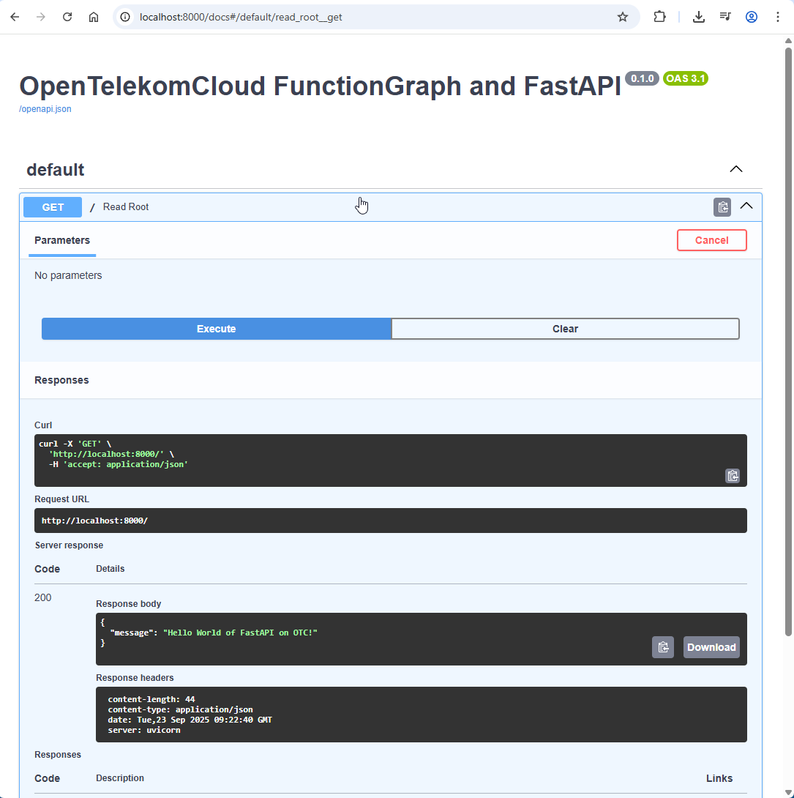
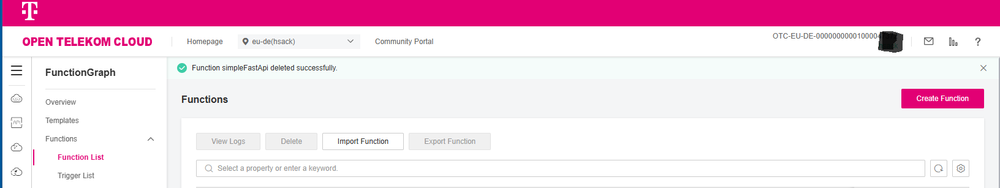
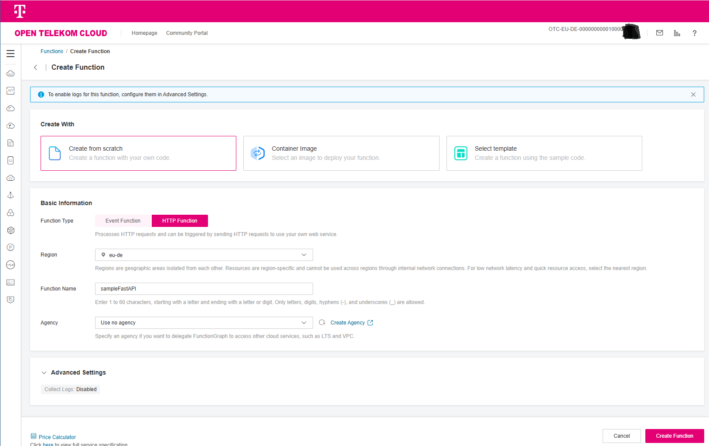
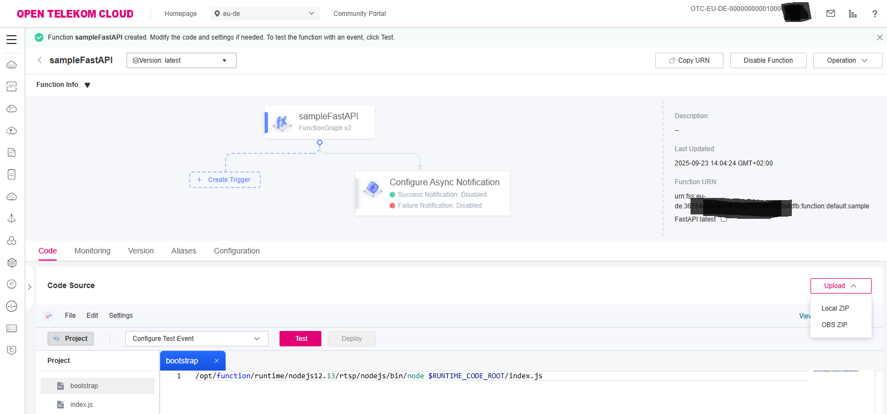
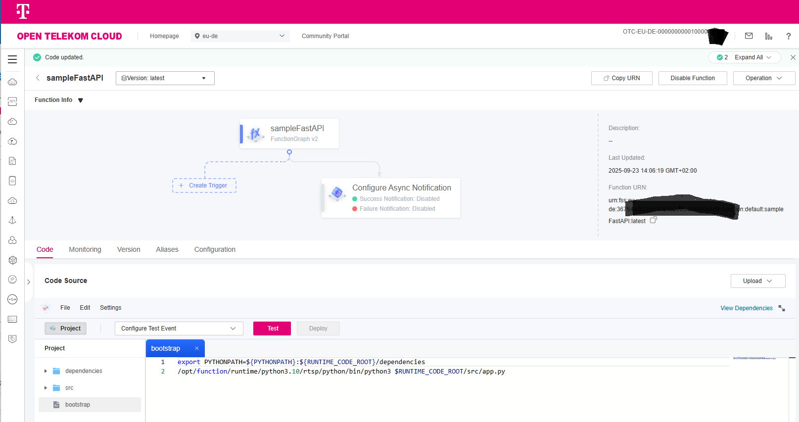
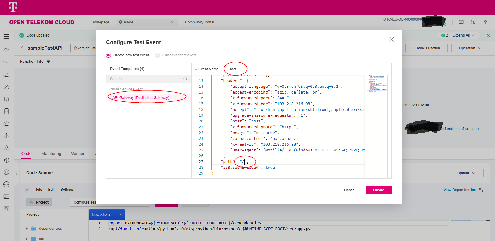
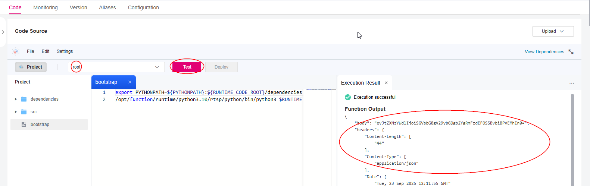

Simple FastApi App Example on Open Telekom Cloud
================================================

.. toctree::
   :maxdepth: 3

This is a simple example on how to create a FastApi application and
deploy it as FunctionGraph HTTP function on Open Telekom Cloud.

Requirements
----------------

* Unix-like environment (Linux or WSL on Windows)
* Python 3.10
* Python virtual environment
* Open Telekom Cloud account

Create FastAPI App
------------------

.. code-block:: bash

    mkdir otc-fastapi-app

    cd otc-fastapi-app

    python3 -m venv .venv

    source .venv/bin/activate

    # Install FastAPI and Uvicorn
    python3 -m pip install fastapi[standard] uvicorn

    mkdir src

Add app.py file in src directory
^^^^^^^^^^^^^^^^^^^^^^^^^^^^^^^^

.. code-block:: python3
    :caption: src/app.py

    from fastapi import FastAPI

    app = FastAPI()

    @app.get("/")
    async def read_root():
        return {"message": "Hello World of FastAPI on OTC!"}

    if __name__ == "__main__":
        import uvicorn

        # On OpenTelekomCloud FunctionGraph port must be 8000
        uvicorn.run("app:app", port=8000, log_level="debug", reload=True, host="localhost")

Run FastAPI app.py locally
^^^^^^^^^^^^^^^^^^^^^^^^^^

.. code-block:: bash

    cd src

    python3 app.py

Open browser with http://localhost:8000/docs

You can test your endpoint by clicking on the **GET / Read Root**
route and then clicking execute.

Deploy FastAPI app as FunctionGraph HTTP function
-------------------------------------------------

Create deployment package
^^^^^^^^^^^^^^^^^^^^^^^^^

Create bootstrap file
*************************************
The bootstrap file is the startup file of the HTTP function.
The HTTP function can only read bootstrap as the startup file name
from the root of the deployment package.

Additional to the startup of the FastAPI app, the bootstrap file must set
the PYTHONPATH to include the dependencies folder.

.. code-block:: bash
    :caption: bootstrap

    export PYTHONPATH=${PYTHONPATH}:${RUNTIME_CODE_ROOT}/dependencies
    /opt/function/runtime/python3.10/rtsp/python/bin/python3 $RUNTIME_CODE_ROOT/src/app.py

Create deployment zip file
*************************************

The structure of the zip file must be like:

.. code-block:: text
    :caption: structure of zip file

      .
      ├── bootstrap
      ├── dependencies
      │   ├── <all dependencies installed in venv>
      └── src
          └── app.py

The following commands create a zip file containing the
dependencies folder, the src folder and the bootstrap file:

.. code-block:: bash
    :caption: Commands to zip for deployment

      rm -r -f target
      mkdir -p target/zip_content/dependencies
      mkdir -p target/zip_content/src
      cp -R .venv/lib/python3.10/site-packages/* target/zip_content/dependencies
      cp -R src target/zip_content
      cp -R bootstrap target/zip_content

      (export TARGET=${PWD}/target && cd target/zip_content && zip -r ${TARGET}/code.zip . --exclude \*__pycache__\*)

Create FunctionGraph HTTP function on Open Telekom Cloud
^^^^^^^^^^^^^^^^^^^^^^^^^^^^^^^^^^^^^^^^^^^^^^^^^^^^^^^^

Login to the `FunctionGraph console <https://console.otc.t-systems.com/functiongraph>`_
and click on **Create Function**.

|

Select **Create from scratch** and as function type select **HTTP function**,
choose a name for your function (e.g. simpleFastApi) and click
on **Create Function**:

|

Now upload the zip file created before
(:file:`target/code.zip`) using the **Upload** - **Local ZIP** button:

|

To test the function, create a test event using the **Test** button:

|

Choose **API Gateway (Dedicated)** from the *Event Template List*.

You can use the sample test event below (see next code block).
Choose a name for the test event (e.g. root) and click on **OK**.

|

The adaption in the test event is the

* ``"httpMethod"`` = **"GET"** (line 11) and
* ``"path"`` = **"/"** (line 27)

field to match your FastAPI endpoint:

.. code-block:: json
    :caption: sample test event
    :linenos:

      {
          "body": "",
          "requestContext": {
              "apiId": "bc1dcffd-aa35-474d-897c-d53425a4c08e",
              "requestId": "11cdcdcf33949dc6d722640a13091c77",
              "stage": "RELEASE"
          },
          "queryStringParameters": {
              "responseType": "html"
          },
          "httpMethod": "GET",
          "pathParameters": {},
          "headers": {
              "accept-language": "q=0.5,en-US;q=0.3,en;q=0.2",
              "accept-encoding": "gzip, deflate, br",
              "x-forwarded-port": "443",
              "x-forwarded-for": "103.218.216.98",
              "accept": "text/html,application/xhtml+xml,application/xml;q=0.9,*/*;q=0.8",
              "upgrade-insecure-requests": "1",
              "host": "host",
              "x-forwarded-proto": "https",
              "pragma": "no-cache",
              "cache-control": "no-cache",
              "x-real-ip": "103.218.216.98",
              "user-agent": "Mozilla/5.0 (Windows NT 6.1; Win64; x64; rv:57.0) Gecko/20100101 Firefox/57.0"
          },
          "path": "/",
          "isBase64Encoded": true
      }

|

and click on **Create**.

Now you can execute the test event using the **Test** button.

The result of the execution is shown below:

|

The full execution result is shown below:

.. code-block:: json
    :caption: Execution result

      {
          "body": "eyJtZXNzYWdlIjoiSGVsbG8gV29ybGQgb2YgRmFzdEFQSSBvbiBPVEMhIn0=",
          "headers": {
              "Content-Length": [
                  "44"
              ],
              "Content-Type": [
                  "application/json"
              ],
              "Date": [
                  "Tue, 23 Sep 2025 10:59:49 GMT"
              ],
              "Server": [
                  "uvicorn"
              ]
          },
          "statusCode": 200,
          "isBase64Encoded": true
      }

|

The body is base64 encoded, to decode the body use following command:

.. code-block:: bash
    :caption: decode body

      echo "eyJtZXNzYWdlIjoiSGVsbG8gV29ybGQgb2YgRmFzdEFQSSBvbiBPVEMhIn0=" | base64 --decode

      # response
      {"message":"Hello World of FastAPI on OTC!"}

Outlook
-------

You can now create an API Gateway trigger together with an API Gateway to
call your FunctionGraph HTTP function from outside the Open Telekom Cloud.

For a full example including API Gateway and Terraform,
see :ref:`Sample <my-reference-sample>`.

